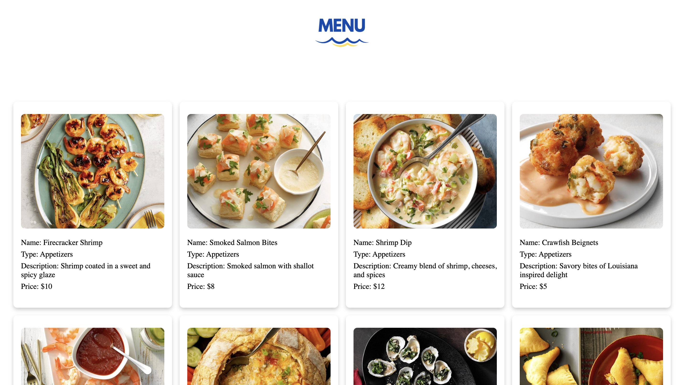

 # Food-Delight

## What is our Project About?
Food-Delight is a seafood restaurant focused on delivering exceptional quality and taste at affordable prices. Our diverse menu offers a range of appetizers, entrées, sides, and desserts, ensuring an exciting dining experience for all. Whether dining in or ordering online, we're committed to providing top-notch service and delicious seafood that leaves customers satisfied and eager to return.

## Tools
### [PostgreSQL]
    Create table and store values that gives us a database.
### [Express] 
    Express is used to handle routing, middleware integration, request/response handling, and much more, simplifying the process of building web servers and web applications in Node.js.
### [Nodemon] 
    To automatically restart the node application when file changes in the directory are detected.
### [Pg-promise] 
    Converts the callback interface into a promises based interface. This allowed us to manipulate our postgresql database from Javascript files.
### [Winston] 
    Simple and universal logging library with support for multiple transports.
### [Bcrypt] 
    We used this technology to encrypt password any personal information.

# [Documentation]

## Home Page
</img>

## Menu Page
</img>

## Login Page
</img>

## Sign Up Page
</img>

## Team Members
### Jessie Hoang

 <a href="https://www.linkedin.com/in/jessiehoang/" style="font-size: 20px;">LinkedIn</a> | <a href="https://github.com/Hoang-J" style="font-size: 20px;">GitHub</a>

### Ashley Davis

 <a href="https://www.linkedin.com/in/adavis07/" style="font-size: 20px;">LinkedIn</a> | <a href="https://github.com/moneymornings" style="font-size: 20px;">GitHub</a>

### Emmanuel Martey

 <a href="https://www.linkedin.com/in/emmanuel-martey-05121410a" style="font-size: 20px;">LinkedIn</a> | <a href="https://github.com/emartey24" style="font-size: 20px;">GitHub</a>

 ### Joel Luke
 
 <a href="https://github.com/loyaltyjones" style="font-size: 20px;">GitHub</a>

                                                                                                                        

<!-- Technology Links -->
[bcrypt]:https://www.npmjs.com/package/bcrypt
[express]:https://www.npmjs.com/package/express
[nodemon]:https://www.npmjs.com/package/nodemon
[Pg-promise]:https://www.npmjs.com/package/pg-promise
[Winston]:https://www.npmjs.com/package/winston
[PostgreSQL]:https://www.postgresqltutorial.com/

<!-- Documentation -->
[Documentation]:https://food-delight-documentation.vercel.app/

<!-- Linkedin|Github Pages -->
[Linkedin]:https://www.linkedin.com/in/jessiehoang/
[Github]:https://github.com/Hoang-J
[Linkedin]:https://www.linkedin.com/in/adavis07/
[Github]:https://github.com/moneymornings
[Linkedin]:https://www.linkedin.com/in/emmanuel-martey-05121410a/
[Github]:https://github.com/emartey24
[Github]:https://github.com/loyaltyjones
