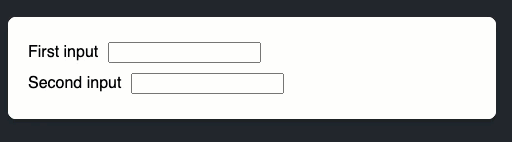

# React Lab Prop Drilling & Lifting State

Fork this repo.
Clone from your personal GitHub Account

## Lab 1 - Synced Inputs

In the `SyncedInputs` component, create a component that has two inputs.

The two inputs are independent. Make them stay in sync: editing one input should update the other input with the same text, and vice versa.

BONUS:  Add a button that clears the inputs.

Output

## Lab 2 - Filter a list

In the `FilterList` component, add a `SearchBar` component and a `List` component.

1. `SearchBar` has its own query state that controls the text input.
2. `List` will accept the props object `items` from the parent.
3. Use the file `data.js` for our list of data.  Notice that there are two things exported from this file.  You will need them both.
4. Use `foods` as our data for the `List` component.  It should `map` over the data and display the food names with the description of the food item. (DON'T FORGET the list KEY!!   Use the id!)
5. Use the `filterItems` function to filter the list according to the search query. To test your changes, verify that typing “s” into the input filters down the list to “Sushi”, “Shish kebab”, and “Dim sum”.

Output:

